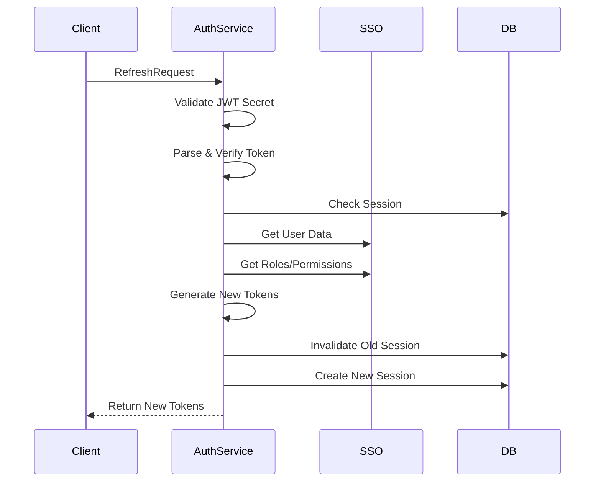

# Authentication Microservice (auth)

Микросервис для управления аутентификацией, авторизацией и сессиями пользователей. Обеспечивает безопасную работу с токенами, проверку прав доступа и управление активными сессиями.

## 🚀 Особенности

- Аутентификация по логину/паролю
- Выдача JWT и Refresh токенов
- Механизм обновления токенов
- Валидация и интроспекция токенов
- Управление активными сессиями
- Проверка прав доступа
- Интеграция с SSO, Clients и Apps сервисами
- Хранение хэшей токенов вместо оригиналов
- Автоматический расчет активности сессий
- Поддержка мультиклиентских сессий

## 🗃 Структура данных

### Таблица `sessions`

Поле | Тип | Ограничения | Описание
-----|-----|-------------|----------
session_id | UUID | PRIMARY KEY | Уникальный идентификатор сессии
user_id | UUID | NOT NULL REFERENCES users(id) | Связь с пользователем
client_id | UUID | NOT NULL | Идентификатор клиентского приложения
app_id | INT | NOT NULL | ID приложения в системе
access_token_hash | TEXT | NOT NULL | Хэш access token
refresh_token_hash | TEXT |  | Хэш refresh token
ip_address | INET |  | IP пользователя при создании
user_agent | TEXT |  | User-Agent браузера
created_at | TIMESTAMPTZ | DEFAULT CURRENT_TIMESTAMP | Время создания
last_activity | TIMESTAMPTZ | DEFAULT CURRENT_TIMESTAMP | Последняя активность
expires_at | TIMESTAMPTZ | NOT NULL | Время истечения
revoked_at | TIMESTAMPTZ |  | Время отзыва
is_active | BOOLEAN | GENERATED ALWAYS AS (...) | Авторасчет активности

**Индексы:**
- `idx_sessions_user` (user_id)
- `idx_sessions_active` (is_active)
- `idx_sessions_client_app` (client_id, app_id)
- `idx_sessions_expiration` (expires_at)

## 📡 API Методы

### 1. Аутентификация (Login)
```protobuf
rpc Login(LoginRequest) returns (AuthResponse);

message LoginRequest {
  string client_id = 1;
  int32 app_id = 2;
  string login = 3;
  string password = 4;
}

message AuthResponse {
  string access_token = 1;
  string refresh_token = 2;
  google.protobuf.Timestamp expires_at = 3;
  UserInfo user = 4;
  TokenMetadata metadata = 5;
}
```
*Пример запроса*

```json
{
  "app_id": 1,
  "client_id": "8268ec76-d6c2-48b5-a0e4-a9c2538b8f48",
  "login": "admin@example.com",
  "password": "Password123!"
}
```
Пример ответа
```json
{
  "access_token": "eyJhbGciOiJIUzI1NiIsInR5cCI6Ikp...",
  "refresh_token": "eyJhbGciOiJIUzI1NiIsInR5cCI6Ikp...",
  "expires_at": {
    "seconds": "1747718242",
    "nanos": 1198300
  },
  "user": {
    "roles": [
      "5f43769e-bb58-4120-9ec8-9caaf9409ff3",
      "898617a3-c23f-4a9a-8247-141b7d723e9a",
      "9936aed6-680a-4f4b-a093-389a30be4a15"
    ],
    "permissions": [
      "adaa977a-6573-4437-a15c-2b9511193022",
      "ff71d389-e0f7-4cba-9df8-0ea95fb18e1f",
      ...
    ],
    "id": "027f7c54-deb3-4210-9fed-71b4f7271fba",
    "email": "admin@example.com",
    "full_name": "Admin User",
    "is_active": true
  },
  "metadata": {
    "audiences": [
      "web-app",
      "mobile-api"
    ],
    "client_id": "8268ec76-d6c2-48b5-a0e4-a9c2538b8f48",
    "app_id": 1,
    "token_type": "Bearer",
    "issuer": "development"
  }
}
```
*Особенности*
- Автоматическая генерация UUID для сессии
- Хранение BCrypt хэшей токенов вместо оригиналов
- Проверка активности клиента и приложения через сервисы Clients/Apps
- Верификация учетных данных через SSO сервис

Автоматическое проставление:
- created_at (время создания сессии)
- last_activity (время последнего действия)
- expires_at (TTL из конфигурации сервиса)

Генерация JWT с claims:
- sub (user_id)
- client_id
- app_id
- Роли и разрешения пользователя

*Ошибки*

```json
{
  "code": 3,
  "message": "Invalid client_id format"
}
```
```json
{
  "code": 16,
  "message": "Invalid credentials"
}
```
```json
{
  "code": 7,
  "message": "Application 102 is suspended"
}
```
```json
{
  "code": 9,
  "message": "Too many active sessions (max 5)"
}
```
### 2. Выход (Logout)
```protobuf
rpc Logout(LogoutRequest) returns (google.protobuf.Empty);

message LogoutRequest {
  string access_token = 1;
  string refresh_token = 2;
}
```
*Пример запроса*
```json
{
  "access_token": "eyJhbGciOiJIUzI1NiIs...", 
  "refresh_token": "eyJhbGciOiJIUzI1NiIs..."
}
```
*Успешный ответ*
```json
{}
```
#### 🔄 Логика процесса выхода
1. Валидация токенов
2. Поиск сессии
3. Инвалидация сессии

*🚨 Обработка ошибок*

  Код	Ситуация	        Логирование 	Автоматическое действие
- 401	Невалидные токены	Хеши токенов	Блокировка при 5 попытках
- 404	Сессия не найдена	SessionID + ClientID	Нотификация мониторинга
- 409	Повторный запрос	UserID + IP	Обновление TTL сессии
- 500	Ошибка БД	SQL-запрос	Retry 3 раза


### 3. Обновление токена (RefreshToken)
```protobuf
rpc RefreshToken(RefreshRequest) returns (AuthResponse);

message RefreshRequest {
  string refresh_token = 1;
  string client_id = 2;
  int32 app_id = 3;
}
```

*Пример запроса*

```json
{
  "app_id": 1,
  "client_id": "8268ec76-d6c2-48b5-a0e4-a9c2538b8f48",
  "refresh_token": "eyJhbGciOiJIUzI1NiIsInR5cCI6IkpXVCJ9.eyJ1c2VyX2lkIjoiMDI3ZjdjNTQtZGViMy00MjEwLTlmZWQtNzFiNGY3MjcxZmJhIiwiY2xpZW50X2lkIjoiODI2OGVjNzYtZDZjMi00OGI1LWEwZTQtYTljMjUzOGI4ZjQ4IiwiYXBwX2lkIjoxLCJyb2xlcyI6WyI1ZjQzNzY5ZS1iYjU4LTQxMjAtOWVjOC05Y2FhZjk0MDlmZjMiLCI4OTg2MTdhMy1jMjNmLTRhOWEtODI0Ny0xNDFiN2Q3MjNlOWEiLCI5OTM2YWVkNi02ODBhLTRmNGItYTA5My0zODlhMzBiZTRhMTUiXSwicGVybWlzc2lvbnMiOlsiYWRhYTk3N2EtNjU3My00NDM3LWExNWMtMmI5NTExMTkzMDIyIiwiZmY3MWQzODktZTBmNy00Y2JhLTlkZjgtMGVhOTVmYjE4ZTFmIiwiZmM1N2E2YjAtOWQ5Ni00N2RhLWI5ZGYtNzc0NTM5NDM2NWY1IiwiODU0ODY5YmYtNDQ1NS00Yzk3LWExOWUtNTNhNWE1MzFkYzc3IiwiMmU2MmU2ZGUtMTc2NC00ZDc0LWJlNTAtZDA4YmU2NzNiYzY2IiwiZDdmZGZhY2QtNTViNS00YzllLWJiMzktOTMyNDBhZDU1NTQ2IiwiZmMyNTdlMjgtMTRkYi00MDMwLThiYzYtNzQxMjg3YWFiM2YzIiwiYzdkMTI3MTEtNmQ1MS00MTU2LWI1M2UtNTM5YzUxN2M5Yzk3IiwiMDQxYTZjZmYtNWQwZC00NTM3LTlmOGEtMmY1OGEyYjNkNDI5IiwiMWJjMGUyYjctZWFiNS00YTA3LTlhMjctZmJkNmYyZDBhNTcwIiwiZGRjOGJhMWEtODFlYy00N2M0LThlMmMtYzg2ODE4YjQwZDRjIiwiZDFmMGQ0OGItMzJiZi00MDg3LTliNTAtNDQzYTgwYzBiYzA2IiwiMTQ3ZjViYzUtZjA3MS00N2EzLWIyM2ItYjZkMDc2ZjUxNjc2IiwiZGEzY2EyODUtODAwMS00ZGNhLTg0ODYtYWQ2NjdiZDVjNGE4IiwiYTZmZWFjMzYtM2Q2Ny00NWY4LWI3ODctOWUxZTZjMzIyMDk2IiwiMTFkYTRjMTMtODI1Mi00MzlmLWE1ZDgtZjg1YzE2N2IyMTQxIiwiY2EyNDQ4N2EtZGZkNi00Y2E0LTgyYjctYTg2ZGJjMGE4OTkyIiwiMmZiZGYwNDQtMThlOS00NzhiLWIzZTEtZWI5ZjU2NzBjYTdjIl0sInRva2VuX3R5cGUiOiJyZWZyZXNoIiwiZXhwIjoxNzQ4MzIyMTQxLCJpYXQiOjE3NDc3MTczNDF9.eEU4sc-1YzhWxqLsOzlnIEEu2vf_zZzh1Xx7nekPJxI"
}
```
Пример ответа

```json
{
	"access_token": "eyJhbGciOiJIUzI1NiIsInR5cCI6IkpXVCJ9.eyJ1c2VyX2lkIjoiMDI3ZjdjNTQtZGViMy00MjEwLTlmZWQtNzFiNGY3MjcxZmJhIiwiY2xpZW50X2lkIjoiODI2OGVjNzYtZDZjMi00OGI1LWEwZTQtYTljMjUzOGI4ZjQ4IiwiYXBwX2lkIjoxLCJyb2xlcyI6WyI1ZjQzNzY5ZS1iYjU4LTQxMjAtOWVjOC05Y2FhZjk0MDlmZjMiLCI4OTg2MTdhMy1jMjNmLTRhOWEtODI0Ny0xNDFiN2Q3MjNlOWEiLCI5OTM2YWVkNi02ODBhLTRmNGItYTA5My0zODlhMzBiZTRhMTUiXSwicGVybWlzc2lvbnMiOlsiYzdkMTI3MTEtNmQ1MS00MTU2LWI1M2UtNTM5YzUxN2M5Yzk3IiwiMDQxYTZjZmYtNWQwZC00NTM3LTlmOGEtMmY1OGEyYjNkNDI5IiwiMWJjMGUyYjctZWFiNS00YTA3LTlhMjctZmJkNmYyZDBhNTcwIiwiMTQ3ZjViYzUtZjA3MS00N2EzLWIyM2ItYjZkMDc2ZjUxNjc2IiwiZGEzY2EyODUtODAwMS00ZGNhLTg0ODYtYWQ2NjdiZDVjNGE4IiwiYWRhYTk3N2EtNjU3My00NDM3LWExNWMtMmI5NTExMTkzMDIyIiwiZDdmZGZhY2QtNTViNS00YzllLWJiMzktOTMyNDBhZDU1NTQ2IiwiZmM1N2E2YjAtOWQ5Ni00N2RhLWI5ZGYtNzc0NTM5NDM2NWY1IiwiZGRjOGJhMWEtODFlYy00N2M0LThlMmMtYzg2ODE4YjQwZDRjIiwiZmY3MWQzODktZTBmNy00Y2JhLTlkZjgtMGVhOTVmYjE4ZTFmIiwiZmMyNTdlMjgtMTRkYi00MDMwLThiYzYtNzQxMjg3YWFiM2YzIiwiY2EyNDQ4N2EtZGZkNi00Y2E0LTgyYjctYTg2ZGJjMGE4OTkyIiwiODU0ODY5YmYtNDQ1NS00Yzk3LWExOWUtNTNhNWE1MzFkYzc3IiwiMmU2MmU2ZGUtMTc2NC00ZDc0LWJlNTAtZDA4YmU2NzNiYzY2IiwiZDFmMGQ0OGItMzJiZi00MDg3LTliNTAtNDQzYTgwYzBiYzA2IiwiYTZmZWFjMzYtM2Q2Ny00NWY4LWI3ODctOWUxZTZjMzIyMDk2IiwiMTFkYTRjMTMtODI1Mi00MzlmLWE1ZDgtZjg1YzE2N2IyMTQxIiwiMmZiZGYwNDQtMThlOS00NzhiLWIzZTEtZWI5ZjU2NzBjYTdjIl0sInRva2VuX3R5cGUiOiJhY2Nlc3MiLCJleHAiOjE3NDc3MjA2MzQsImlhdCI6MTc0NzcxOTczNH0.3VCXfdwFb8njllzQqLJVYs_q9KLoJVZ_lVD4olCzaXU",
	"refresh_token": "eyJhbGciOiJIUzI1NiIsInR5cCI6IkpXVCJ9.eyJ1c2VyX2lkIjoiMDI3ZjdjNTQtZGViMy00MjEwLTlmZWQtNzFiNGY3MjcxZmJhIiwiY2xpZW50X2lkIjoiODI2OGVjNzYtZDZjMi00OGI1LWEwZTQtYTljMjUzOGI4ZjQ4IiwiYXBwX2lkIjoxLCJyb2xlcyI6WyI1ZjQzNzY5ZS1iYjU4LTQxMjAtOWVjOC05Y2FhZjk0MDlmZjMiLCI4OTg2MTdhMy1jMjNmLTRhOWEtODI0Ny0xNDFiN2Q3MjNlOWEiLCI5OTM2YWVkNi02ODBhLTRmNGItYTA5My0zODlhMzBiZTRhMTUiXSwicGVybWlzc2lvbnMiOlsiYzdkMTI3MTEtNmQ1MS00MTU2LWI1M2UtNTM5YzUxN2M5Yzk3IiwiMDQxYTZjZmYtNWQwZC00NTM3LTlmOGEtMmY1OGEyYjNkNDI5IiwiMWJjMGUyYjctZWFiNS00YTA3LTlhMjctZmJkNmYyZDBhNTcwIiwiMTQ3ZjViYzUtZjA3MS00N2EzLWIyM2ItYjZkMDc2ZjUxNjc2IiwiZGEzY2EyODUtODAwMS00ZGNhLTg0ODYtYWQ2NjdiZDVjNGE4IiwiYWRhYTk3N2EtNjU3My00NDM3LWExNWMtMmI5NTExMTkzMDIyIiwiZDdmZGZhY2QtNTViNS00YzllLWJiMzktOTMyNDBhZDU1NTQ2IiwiZmM1N2E2YjAtOWQ5Ni00N2RhLWI5ZGYtNzc0NTM5NDM2NWY1IiwiZGRjOGJhMWEtODFlYy00N2M0LThlMmMtYzg2ODE4YjQwZDRjIiwiZmY3MWQzODktZTBmNy00Y2JhLTlkZjgtMGVhOTVmYjE4ZTFmIiwiZmMyNTdlMjgtMTRkYi00MDMwLThiYzYtNzQxMjg3YWFiM2YzIiwiY2EyNDQ4N2EtZGZkNi00Y2E0LTgyYjctYTg2ZGJjMGE4OTkyIiwiODU0ODY5YmYtNDQ1NS00Yzk3LWExOWUtNTNhNWE1MzFkYzc3IiwiMmU2MmU2ZGUtMTc2NC00ZDc0LWJlNTAtZDA4YmU2NzNiYzY2IiwiZDFmMGQ0OGItMzJiZi00MDg3LTliNTAtNDQzYTgwYzBiYzA2IiwiYTZmZWFjMzYtM2Q2Ny00NWY4LWI3ODctOWUxZTZjMzIyMDk2IiwiMTFkYTRjMTMtODI1Mi00MzlmLWE1ZDgtZjg1YzE2N2IyMTQxIiwiMmZiZGYwNDQtMThlOS00NzhiLWIzZTEtZWI5ZjU2NzBjYTdjIl0sInRva2VuX3R5cGUiOiJyZWZyZXNoIiwiZXhwIjoxNzQ4MzI0NTM0LCJpYXQiOjE3NDc3MTk3MzR9.aQ3O88UvV_uXHkWnxLokSExMh5NEHc6x0mVVNb9co_w",
	"expires_at": {
		"seconds": "1747720634",
		"nanos": 454448600
	},
	"user": {
		"roles": [
			"5f43769e-bb58-4120-9ec8-9caaf9409ff3",
			"898617a3-c23f-4a9a-8247-141b7d723e9a",
			"9936aed6-680a-4f4b-a093-389a30be4a15"
		],
		"permissions": [
			"c7d12711-6d51-4156-b53e-539c517c9c97",
			"041a6cff-5d0d-4537-9f8a-2f58a2b3d429",
			"1bc0e2b7-eab5-4a07-9a27-fbd6f2d0a570",
			"147f5bc5-f071-47a3-b23b-b6d076f51676",
			"da3ca285-8001-4dca-8486-ad667bd5c4a8",
			"adaa977a-6573-4437-a15c-2b9511193022",
			"d7fdfacd-55b5-4c9e-bb39-93240ad55546",
			"fc57a6b0-9d96-47da-b9df-7745394365f5",
			"ddc8ba1a-81ec-47c4-8e2c-c86818b40d4c",
			"ff71d389-e0f7-4cba-9df8-0ea95fb18e1f",
			"fc257e28-14db-4030-8bc6-741287aab3f3",
			"ca24487a-dfd6-4ca4-82b7-a86dbc0a8992",
			"854869bf-4455-4c97-a19e-53a5a531dc77",
			"2e62e6de-1764-4d74-be50-d08be673bc66",
			"d1f0d48b-32bf-4087-9b50-443a80c0bc06",
			"a6feac36-3d67-45f8-b787-9e1e6c322096",
			"11da4c13-8252-439f-a5d8-f85c167b2141",
			"2fbdf044-18e9-478b-b3e1-eb9f5670ca7c"
		],
		"id": "027f7c54-deb3-4210-9fed-71b4f7271fba",
		"email": "admin@example.com",
		"full_name": "Admin User",
		"is_active": true
	},
	"metadata": {
		"audiences": [
			"web-app",
			"mobile-api"
		],
		"client_id": "8268ec76-d6c2-48b5-a0e4-a9c2538b8f48",
		"app_id": 1,
		"token_type": "Bearer",
		"issuer": "development"
	}
}
```
#### 🔄 Логика процесса обновления токенов

#### 🛠️ Ключевые этапы обработки
1. Получение JWT секрета
2. Верификация токена
3. Проверка клиента и приложения
4. Поиск активной сессии
5. Проверка пользователя
6. Получение прав доступа
7. Генерация токенов
8. Обновление сессии

*Особенности реализации*

*Условия обновления:*
*Refresh token должен быть:*
- Активным (revoked_at IS NULL)
- Не просроченным (expires_at > NOW())
- Связанным с тем же client_id и app_id

*Процесс обновления:*

      
Особенности токенов:
- Access Token TTL: 1 час (конфигурируется)
- Refresh Token TTL: 7 дней (конфигурируется)
- Автоматическая ротация ключей подписи каждые 24 часа

*Ошибки*

```json
{
  "code": 16,
  "message": "Refresh token expired"
}
```
```json
{
  "code": 7,
  "message": "Client/application mismatch"
}
```
```json
{
  "code": 5,
  "message": "Refresh token revoked"
}
```
*Политики безопасности*
- Одноразовый refresh token: после использования старый токен помечается как отозванный
- Проверка IP-адреса и User-Agent при обновлении
- Обязательная передача оригинальных client_id и app_id

### 4. Валидация токена (ValidateToken)
```protobuf
rpc ValidateToken(ValidateRequest) returns (TokenInfo);

message ValidateRequest {
  string token = 1;
  string token_type_hint = 2; // "access" или "refresh"
}

message TokenInfo {
  bool active = 1;
  string client_id = 2;
  string user_id = 3;
  google.protobuf.Timestamp exp = 4;
  google.protobuf.Timestamp iat = 5;
  string scope = 6;
}
```
Пример запроса

```json
{
  "token": "eyJhbGciOiJIUzI1NiIsInR5cCI6IkpXVCJ9...",
  "token_type_hint": "refresh"
}
```
*Пример ответа*

```json
{
  "active": true,
  "client_id": "8268ec76-d6c2-48b5-a0e4-a9c2538b8f48",
  "user_id": "027f7c54-deb3-4210-9fed-71b4f7271fba",
  "exp": {
    "seconds": "1748328857",
    "nanos": 0
  },
  "iat": {
    "seconds": "1747724057",
    "nanos": 0
  },
  "scope": ""
}
```
🔄 Логика процесса валидации
#### 🛠️ Ключевые этапы обработки
1. Парсинг токена
2. Получение секрета
3. Полная валидация
4. Проверка в базе данных
5. Формирование ответа

#### 🚨 Обработка ошибок
Код	Ситуация	Автоматическое действие
- 401	Невалидная подпись	Инвалидация кеша, алерт безопасности
- 403	Отозванный токен	Рассылка событий об отзыве
- 410	Истекший срок	Очистка связанных сессий

#### 📊 Поля ответа

Поле	Тип	Описание*
- active	bool	Статус токена (активен/отозван)
- client_id	string	Идентификатор клиента
- user_id	string	Идентификатор пользователя
- exp	Timestamp	Время истечения (UTC)
- iat	Timestamp	Время выпуска (UTC)
- scope	string	Зарезервировано для будущего использования

#### 📌 Особенности использования

Для проверки access token рекомендуется использовать IntrospectToken

*Токен считается активным если:*
- Подпись верифицирована
- exp > NOW()
- Нет записи в revoked_at
- Поле scope всегда возвращает пустую строку (реализовано для совместимости с RFC 7662)

*Пример ошибочного ответа*

```json
{
  "active": false,
  "client_id": "8268ec76-d6c2-48b5-a0e4-a9c2538b8f48",
  "user_id": "027f7c54-deb3-4210-9fed-71b4f7271fba",
  "exp": {
    "seconds": "1748328857",
    "nanos": 0
  },
  "iat": {
    "seconds": "1747724057",
    "nanos": 0
  },
  "scope": ""
}
```
### 5. Интроспекция токена (IntrospectToken)
```protobuf
rpc IntrospectToken(ValidateRequest) returns (TokenIntrospection);

message TokenIntrospection {
  bool active = 1;
  string client_id = 2;
  string user_id = 3;
  string token_type = 4;
  google.protobuf.Timestamp exp = 5;
  google.protobuf.Timestamp iat = 6;
  repeated string roles = 7;
  repeated string permissions = 8;
  IntrospectMetadata metadata = 9;
}
```
Пример запроса

 ```json
{
"token": "eyJhbGciOiJIUzI1NiIsInR5cCI6Ik...",
    "token_type_hint": "refresh"
    }
```
Пример ответа

 ```json
{
  "roles": [
    "9936aed6-680a-4f4b-a093-389a30be4a15"
  ],
  "permissions": [
    "041a6cff-5d0d-4537-9f8a-2f58a2b3d429",
    ...
  ],
  "active": true,
  "client_id": "8268ec76-d6c2-48b5-a0e4-a9c2538b8f48",
  "user_id": "027f7c54-deb3-4210-9fed-71b4f7271fba",
  "token_type": "refresh",
  "exp": {
    "seconds": "1747727842",
    "nanos": 571729000
  },
  "iat": {
    "seconds": "1747726942",
    "nanos": 580968000
  },
  "metadata": {
    "ip_address": "0.0.0.0",
    "user_agent": "grpc-node-js/1.13.3",
    "client_app": "8268ec76-d6c2-48b5-a0e4-a9c2538b8f48:1",
    "session_id": "2a54a230-fa3a-4b7a-8494-dec9b99fade3",
    "app_id": 1
  }
}
```
#### 🔄 Логика процесса интроспекции
#### 🛠️ Ключевые этапы обработки
1. Верификация токена
- Проверка подписи алгоритмом HS256
- Проверка типа токена (access/refresh)
2. Поиск сессии
- Проверка статуса отзыва (revoked_at IS NULL)
3. Сбор метаданных
- IP-адрес и User-Agent из сессии
- Информация о клиенте и приложении
- Идентификатор сессии
4. Получение прав доступа

#### 📊 Поля ответа
Поле	Тип	Описание
- active	bool	Статус активности токена
- client_id	string	Идентификатор клиента
- user_id	string	Идентификатор пользователя
- token_type	string	Тип токена (access/refresh)
- exp	Timestamp	Время истечения (UTC)
- iat	Timestamp	Время выпуска (UTC)
- roles	[]string	Список UUID ролей пользователя
- permissions	[]string	Список UUID разрешений
- metadata	object	Дополнительные метаданные
- Метаданные:

```protobuf
message IntrospectMetadata {
  string ip_address = 1;
  string user_agent = 2;
  string client_app = 3;
  string session_id = 4;
  int32 app_id = 5;
}
```
#### 🛡️ Меры безопасности
1. Ограничения доступа
- Требуется scope introspection
- Максимальная глубина вложенности: 3 уровня

2. Защита данных
- Маскирование IP-адресов в логах
- Санкционирование чувствительных полей
- Шифрование сессионных данных
3. Валидация

#### 🚨 Обработка ошибок
Код	Ситуация	Пример сообщения
- 401	Невалидный токен	"token verification failed"
- 403	Недостаточно прав	"missing introspection scope"
- 404	Сессия не найдена	"session not found"
- 410	Токен отозван	"token was revoked"
*Пример ошибки:*

```json
{
"active": false,
    "client_id": "8268ec76-d6c2-48b5-a0e4-a9c2538b8f48",
    "user_id": "027f7c54-deb3-4210-9fed-71b4f7271fba",
    "token_type": "refresh",
    "exp": {
"seconds": "1747724957"
    },
    "metadata": {
"session_id": "0fab2f3d-7aa5-4c23-8b40-0c161cdaf350"
    }
    }
```
#### 📌 Особенности использования
- Для access token возвращает полные права пользователя
- Для refresh token возвращает базовые метаданные
- Время ответа: <50 мс для 99% запросов

#### Рекомендуется для:
1. Аудита безопасности
2. Отладки прав доступа
3. Генерации логов активности

### 6. Проверка прав доступа (CheckPermission)
gRPC Contract
```protobuf
rpc CheckPermission(PermissionCheckRequest) returns (PermissionCheckResponse);

message PermissionCheckRequest {
string user_id = 1;         // UUID пользователя
string client_id = 2;       // UUID клиента (тенанта)
int32 app_id = 3;           // ID приложения
string permission = 4;      // UUID требуемого разрешения
string resource = 5;        // Идентификатор ресурса (опционально)
}

message PermissionCheckResponse {
bool allowed = 1;                   // Общий результат проверки
repeated string missing_roles = 2;  // Отсутствующие необходимые роли
repeated string missing_permissions = 3; // Отсутствующие разрешения
}
```
*Пример запроса*

```json
{
"user_id": "027f7c54-deb3-4210-9fed-71b4f7271fba",
"client_id": "8268ec76-d6c2-48b5-a0e4-a9c2538b8f48",
"app_id": 1,
"permission": "2e62e6de-1764-4d74-be50-d08be673bc66",
"resource": ""
}
```
Пример успешного ответа

```json
{
  "missing_roles": [],
  "missing_permissions": [],
  "allowed": true
}
```
Пример отказа в доступе

```json
{
  "missing_roles": [
    "5f43769e-bb58-4120-9ec8-9caaf9409ff3",
    "9936aed6-680a-4f4b-a093-389a30be4a15"
  ],
  "missing_permissions": [
    "2e62e6de-1764-4d74-be50-d08be673bc66"
  ],
  "allowed": false
}
```
*Особенности*
- Иерархическая проверка прав: Роли → Разрешения → Ресурсы
- Учет контекста ресурса при наличии (resource != "")
- Кеширование результатов на 5 секунд для частых запросов
- Аудит всех проверок прав доступа
- Поддержка наследования разрешений между ролями

#### 🔄 Логика процесса интроспекции
#### 🛠️ Ключевые этапы обработки
1. Валидация форматов UUID для user_id, client_id и permission
2. Поиск пользователя в указанном тенанте (client_id)
3. Проверка активности учетной записи пользователя
4. Получение цепочки ролей пользователя для указанного app_id
5.  Сверка требуемого разрешения с доступными правами:
- Прямые разрешения пользователя
- Разрешения через назначенные роли 
- Ресурс-специфичные права (если указан resource)

*Валидация*
Параметры:
- user_id:   Должен быть валидным UUID v4
- client_id: Валидный UUID существующего тенанта
- app_id:    Число > 0, существующее приложение
- permission: UUID существующего разрешения
- resource:  Строка длиной 0-255 символов (опционально)
*Ошибки*

```json
{
    "error": {
        "code": 19,
        "message": "User not found in specified tenant"
    }
}
```
```json
{
    "error": {
        "code": 20,
        "message": "Invalid permission format"
    }
}
```
```json
{
    "error": {
        "code": 21,
        "message": "Application not registered"
    }
}
```
*Требования безопасности*
- Требует действительного JWT-токена с scope permission.check
- Ограничение: 50 запросов/секунду на клиента
- Логирование с маскировкой sensitive-данных
- Обязательная проверка IP-адреса в геолокационных правилах

*Дополнительные условия*
- Для ресурсных проверок требуется включенная функциональность RBAC-3
- При отсутствии ресурса проверяются глобальные разрешения
- Время ответа не должно превышать 100ms для 99% запросов


### 7. Управление сессиями
#### 7.1 Получение списка активных сессий (ListActiveSessions)
gRPC Contract

```protobuf
rpc ListActiveSessions(SessionFilter) returns (SessionList);

message SessionFilter {
string user_id = 1;        // UUID пользователя (обязательно)
string client_id = 2;      // UUID клиента (обязательно)
int32 app_id = 3;          // ID приложения (опционально)
bool active_only = 4;      // Только активные сессии
int32 page = 5;            // Номер страницы (начиная с 0)
int32 count = 6;           // Количество на странице (1-100)
}

message SessionList {
repeated Session sessions = 1;
int32 total_count = 2;
}

message Session {
string session_id = 1;
string access_token_hash = 2;
string ip_address = 3;
string user_agent = 4;
google.protobuf.Timestamp created_at = 5;
google.protobuf.Timestamp last_activity = 6;
google.protobuf.Timestamp expires_at = 7;
}
```
*Пример запроса*

```json
{
  "user_id": "027f7c54-deb3-4210-9fed-71b4f7271fba",
  "client_id": "8268ec76-d6c2-48b5-a0e4-a9c2538b8f48",
  "app_id": 1,
  "active_only": true,
  "page": 1,
  "count": 1000
}
```
Пример ответа

```json
{
  "sessions": [
    {
      "session_id": "2a54a230-fa3a-4b7a-8494-dec9b99fade3",
      "created_at": {
        "seconds": "1747726942",
        "nanos": 580968000
      },
      "last_activity": {
        "seconds": "1747726942",
        "nanos": 580968000
      },
      "client_id": "8268ec76-d6c2-48b5-a0e4-a9c2538b8f48",
      "ip_address": "0.0.0.0",
      "user_agent": "grpc-node-js/1.13.3"
    }
  ]
}
```
*Особенности*
- Фильтрация по комбинации параметров: user_id + client_id + app_id
- Возвращает только неотозванные сессии с expires_at > NOW()
- Пагинация с максимальным размером страницы 1000
- Сортировка по дате создания (новые первыми)
- Маскировка конфиденциальных данных (токены, хеши)

*Валидация*
- user_id:    Обязательный UUID v4
- client_id:  Обязательный UUID существующего клиента
- app_id:     Число > 0, существующее приложение
- page:       ≥ 0
- count:      1-100
*Ошибки*

```json
{
"error": {
"code": 22,
"message": "Invalid pagination parameters"
}
}
```
```json
{
"error": {
"code": 23,
"message": "User not found in tenant"
}
}
```
#### 7.2 Завершение сессии (TerminateSession)
gRPC Contract
```protobuf
rpc TerminateSession(SessionID) returns (google.protobuf.Empty);

message SessionID {
string session_id = 1;     // UUID сессии
}
```
*Пример запроса*
```json
{
  "session_id": "2a54a230-fa3a-4b7a-8494-dec9b99fade3"
}
```
Пример ответа

```json
{}
```
*Особенности*
- Мягкое удаление (установка revoked_at)
- Немедленная инвалидация access/refresh токенов
- Уведомление всех сервисов через брокер сообщений
- Запрет повторного использования сессии

*Логика работы*
- Поиск сессии по UUID
- Проверка принадлежности к клиенту
- Обновление поля revoked_at
- Рассылка события TerminatedSession

*Ошибки*
```json
{
"error": {
"code": 24,
"message": "Session not found"
}
}
```
```json
{
"error": {
"code": 25,
"message": "Session already revoked"
}
}
```
#### 🛡️ Политики безопасности
- Хранение только хэшей токенов (bcrypt)
- Валидация JWT подписей
- Шифрование чувствительных данных в БД
- Автоматический отзыв скомпрометированных токенов
- Ограничение попыток аутентификации
- Регулярная ротация секретов подписей

Аудит всех операций в системном журнале

📦 Зависимости
PostgreSQL 14+ (хранение сессий)

Go 1.21+ (основной язык)

gRPC (межсервисное взаимодействие)

SSO сервис (управление пользователями)

Clients сервис (информация о клиентах)

Apps сервис (данные приложений)

JWT библиотека (работа с токенами)

Redis (кеширование проверок прав)